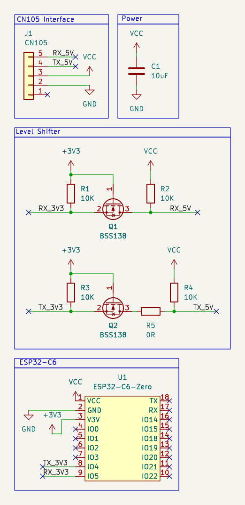

# Hardware

KiCad PCB for a [Waveshare ESP32-C6-Zero](https://www.waveshare.com/esp32-c6-zero.htm) carrier that plugs into a Mitsubishi **CN105** service port.

| Item | Details |
| --- | --- |
| MCU footprint | `Waveshare-ESP32:Waveshare-ESP32-C6-Zero_THT` (2×9 pin headers) |
| CN105 connector | `JST:JST_PA_B05B-PASK-1_1x05_P2.00mm_Vertical_CN105` |
| Level shifting | 5 V UART from the unit → 3.3 V for the ESP |



## Open in KiCad

```bash
kicad hardware/mitsubishi2zigbee.kicad_pro
```

Project-specific symbol and footprint libraries live in `libs/`.

## Layout

```
hardware/
├── README.md
├── schematic.png
├── mitsubishi2zigbee.kicad_pro
├── mitsubishi2zigbee.kicad_sch
├── mitsubishi2zigbee.kicad_pcb
├── fp-lib-table
├── sym-lib-table
└── libs/
    ├── JST.pretty/
    ├── Waveshare-ESP32.pretty/
    └── Waveshare-ESP32.kicad_sym
```
